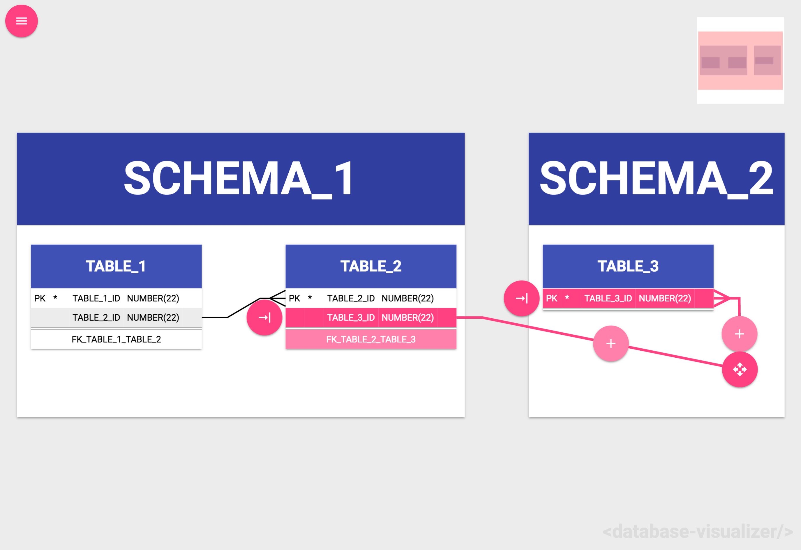
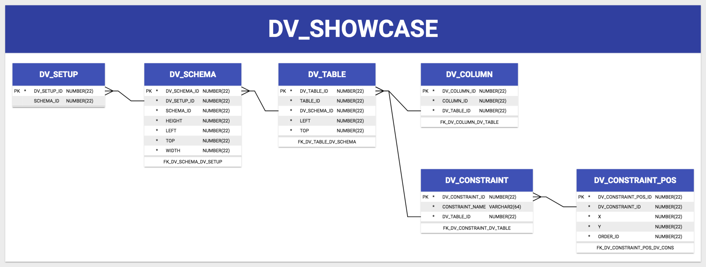

# database-visualizer

An element providing a solution for a visualization of a relational database.

Example:

    <database-visualizer></database-visualizer>

An element providing a solution for a visualization of a relational database with a menu.

Example:

    <database-visualizer-app></database-visualizer-app>

## Polymer Documentation & Demo

[Polymer Documentation](https://thorbenvh8.github.io/polymer-database-visualizer/)
[Only Demo](https://thorbenvh8.github.io/polymer-database-visualizer/demo/)

## Dependencies

Element dependencies are managed via [Bower](http://bower.io/). You can
install that via:

    npm install -g bower

Then, go ahead and download the element's dependencies:

    bower install thorbenvh8/polymer-database-visualizer

## Playing With It

If you wish to work on your element in isolation, we recommend that you use
[Polyserve](https://github.com/PolymerLabs/polyserve) to keep your element's
bower dependencies in line. You can install it via:

    npm install -g polyserve

And you can run it via:

    polyserve

Once running, you can preview your element at
`http://localhost:8080/components/database-visualizer/`, where `database-visualizer` is the name of the directory containing it.

## Develop Backend (SQLS)

Execut the following script to create the tables to saving positions in the datbase [here](sqls/tables.sql).
Sqls to select and update the tables can be found [here](sqls/sqls.xml).

## Testing It

Simply navigate to the `/test` directory of your element to run its tests. If
you are using Polyserve: `http://localhost:8080/components/database-visualizer/test/`

### web-component-tester

The tests are compatible with [web-component-tester](https://github.com/Polymer/web-component-tester).
Install it via:

    npm install -g web-component-tester

Then, you can run your tests on _all_ of your local browsers via:

    wct

#### WCT Tips

`wct -l chrome` will only run tests in chrome.

`wct -p` will keep the browsers alive after test runs (refresh to re-run).

`wct test/some-file.html` will test only the files you specify.
